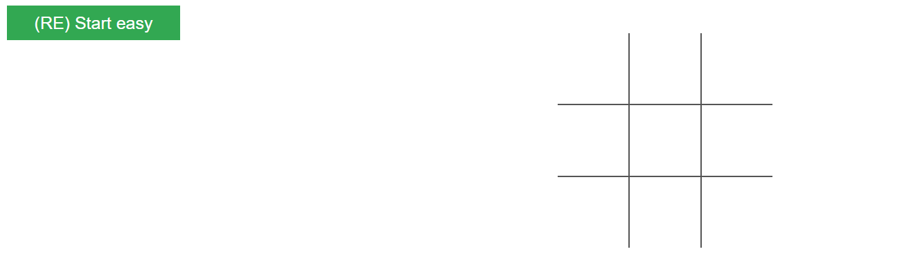
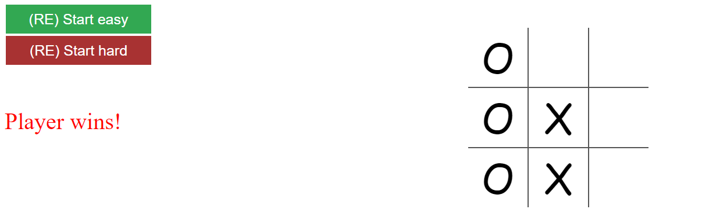
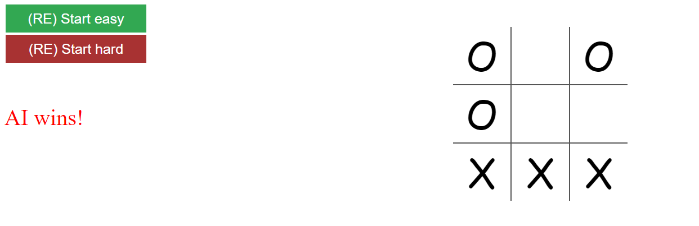
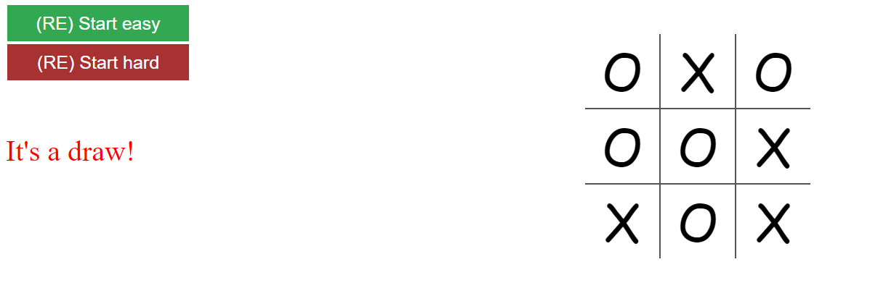

# Personal project - Nagy beadandó - Tic-Tac-Toe játék F# SPA megvalósítással
Ez a project a végső beadandó feladat, én egy Single Page Application-t készítettem, ami egy Tic-Tac-Toe játékot valósít meg. A Project **Visual Studio**-ban íródott, a template: **Websharper 4 Single Page Application (.NET Core)**

A befejezett project kinézete:

# Fontos file-ok

A project két fontos file-t tartalmaz, az **index.html** és **Client.fs** fileokat. Előbbiben van megtervezve a UI, a HTML layout, utóbbiban pedig a program logika.

# A project állapota

A project egy teljesen működő Tic-Tac-Toe játék, mely képes érzékelni hogy a player vagy az AI nyer, vagy hogy esetleg döntetlen lett a játék. Egy nagyon egyszerű AI lett megvalósítva, ami lényegében randomra helyezi le a lépéseit.

# A projekt futtatása

A **Visual Studio** felső menüjében található gombbal elindítható a project, és sikeresen le is kell futnia.

 Ha minden rendben ment, egy böngésző ablak fog nyílni, ahol a project elején lévő látvány kell hogy fogadjon minket. Itt a játékmezőre való kattintással elindítható a menet, minden kattintásunk után az AI is automatikusan lépni fog. Nézzük meg a lehetséges három játékkimenetet:

- Player win:

- AI win:

- Draw

A játék természetesen újraindítható bármikor, ha a bal felső sarokban található gombra nyomunk. 